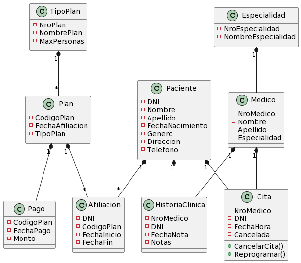
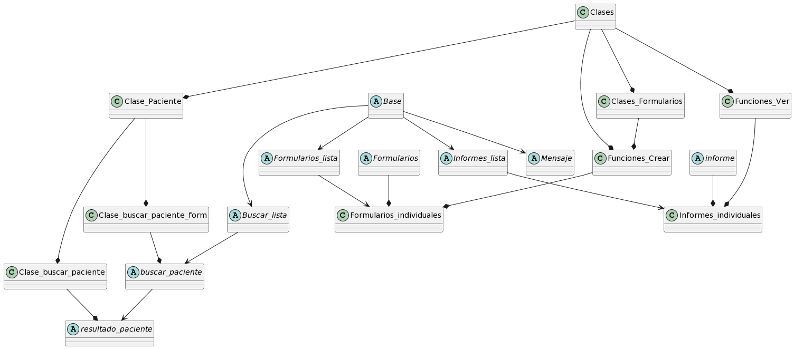

El siguiente proyecto intenta crear un modelo de página de gestión de un centro médico, lo que incluye tanto la gestión comercial como la médica. Si bien tanto el nombre como los datos ingresados son ficticios, el trabajo está basado en situaciones reales.

La operatoria del centro es la siguiente: los pacientes pueden venir a una cita particular o afiliarse al centro. Existen distintos planes, el cual puede ser individual o grupal. El paciente puede optar por afiliarse a él o al grupo familiar, y puede cambiar de afiliación en cualquier momento. Cuando paga su afiliación, lo paga por todo el grupo.

El centro atiende diversas especialidades, y cada especialidad posee varios médicos que la ejercen. Los médicos programan citas con los pacientes, con una fecha determinada, que se puede cancelar o reprogramar.

Los médicos, a través de las consultas, confeccionan la historia clínica del paciente, que son una serie de notas que describen las condiciones médicas del paciente. Solamente los médicos pueden leer la historia clínica.

Cada objeto descrito anteriormente corresponde a una clase. El mapa de las clases y relaciones entre ellas se describe a continuación:

En cuanto a la página de inicio, esta es Base.html, de la cual todas las otras páginas heredan la estructura.
A partir de la página de inicio, se puede ir a tres tipos de página: Formularios (para ingresar datos), Informes (para ver la lista de objetos existentes) y Búsquedas (para buscar ciertos objetos).

Todas las clases de objetos tienen una clase Form dependiente, y éstas a su vez una función modelo(funciones crear , en models.py), con su URL. Todas las vistas tienen a formularios.html como modelo.
De la misma manera, cada clase tiene una función modelo (funciones ver), que tienen a informe.html como modelo.

En el caso particular de la clase Pacientes, se puede buscar los datos particulares a través de la función buscar_paciente, la cual está asociada a resultado_paciente.html.

Las relaciones entre páginas y clases es la siguiente:

Aparte de la página de gestión, hay una página de gestión del usuario. En esta página, se pueden crear avatares y mandar mensajes entre usuarios. Se necesita registrar para poder acceder a ciertos datos de la gestión. Todas la gestión del usuario está en la app de UsuariosApp